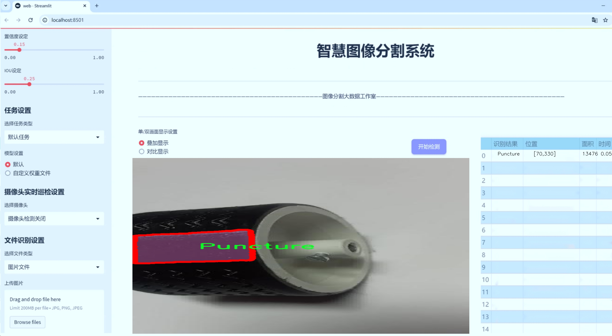
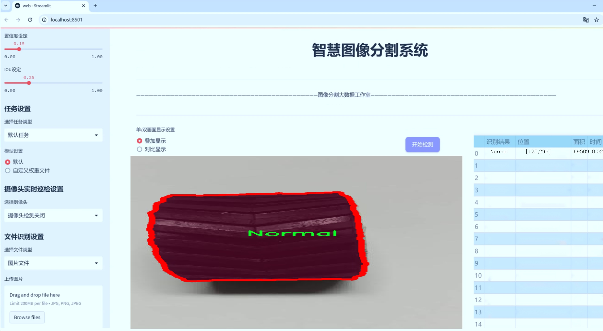
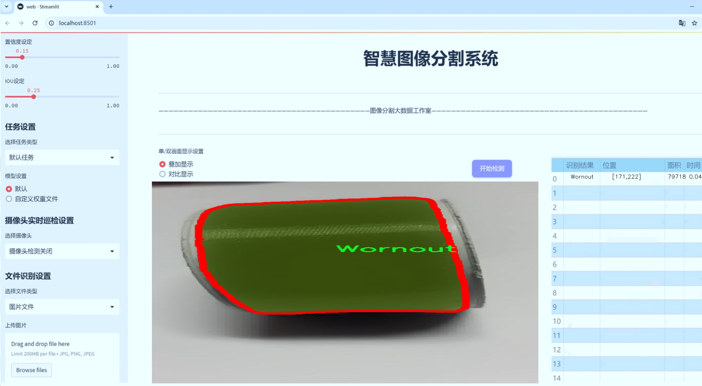
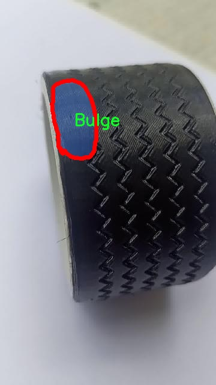
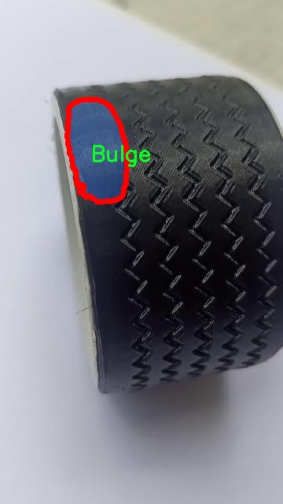
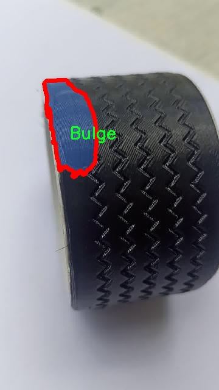
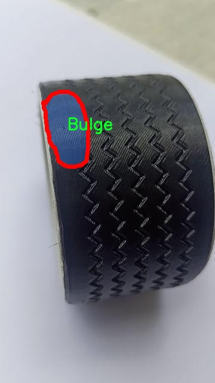
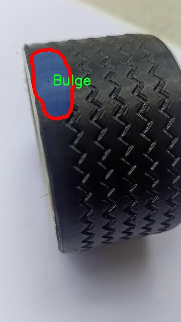

# 轮胎缺陷分割系统源码＆数据集分享
 [yolov8-seg-aux＆yolov8-seg-C2f-RFAConv等50+全套改进创新点发刊_一键训练教程_Web前端展示]

### 1.研究背景与意义

项目参考[ILSVRC ImageNet Large Scale Visual Recognition Challenge](https://gitee.com/YOLOv8_YOLOv11_Segmentation_Studio/projects)

项目来源[AAAI Global Al lnnovation Contest](https://kdocs.cn/l/cszuIiCKVNis)

研究背景与意义

轮胎作为汽车的重要组成部分，其安全性和性能直接关系到行车安全和驾驶体验。随着汽车工业的快速发展，轮胎的使用频率和种类日益增加，轮胎缺陷的检测与分析变得尤为重要。轮胎缺陷不仅影响车辆的行驶稳定性，还可能导致严重的交通事故。因此，开发高效、准确的轮胎缺陷检测系统，能够及时识别和分类轮胎的各种缺陷，对于保障行车安全、降低事故风险具有重要的现实意义。

近年来，深度学习技术的迅猛发展为图像处理和目标检测领域带来了新的机遇。YOLO（You Only Look Once）系列模型因其高效的实时检测能力和良好的准确性，逐渐成为目标检测任务中的主流选择。YOLOv8作为该系列的最新版本，在特征提取和检测精度上有了显著提升，能够处理复杂场景下的物体检测任务。然而，传统的YOLO模型在细粒度的缺陷分割任务中仍存在一定的局限性，尤其是在处理多类缺陷时，如何提高模型的分割精度和鲁棒性是一个亟待解决的问题。

本研究旨在基于改进的YOLOv8模型，构建一个高效的轮胎缺陷分割系统。该系统将利用包含1200张图像的轮胎缺陷数据集进行训练和验证。数据集中涵盖了六类轮胎缺陷，包括鼓包（Bulge）、切割（Cut）、正常（Normal）、穿刺（Puncture）、侧壁（Sidewall）和磨损（Wornout），这些缺陷的多样性为模型的训练提供了丰富的样本和挑战。通过对这些缺陷进行准确的实例分割，能够帮助检测人员快速识别轮胎的状态，从而制定相应的维护和更换策略。

改进YOLOv8模型的关键在于如何有效地融合多层次特征信息，以提高对不同缺陷的识别能力。同时，采用数据增强技术和迁移学习策略，可以在有限的数据集上提升模型的泛化能力和鲁棒性。此外，针对轮胎缺陷的特殊性，研究还将探索如何通过改进损失函数和后处理方法，进一步提高分割精度和检测效率。

本研究的意义不仅在于推动轮胎缺陷检测技术的发展，更在于为汽车安全提供有力的技术支持。通过构建高效的轮胎缺陷分割系统，能够为汽车制造商、维修服务商以及消费者提供更为可靠的轮胎状态评估工具，从而降低事故发生率，提升行车安全。同时，该研究的成果也可为其他领域的缺陷检测提供借鉴，推动深度学习技术在工业检测中的应用与发展。综上所述，基于改进YOLOv8的轮胎缺陷分割系统的研究具有重要的理论价值和实际应用意义。

### 2.图片演示







##### 注意：由于此博客编辑较早，上面“2.图片演示”和“3.视频演示”展示的系统图片或者视频可能为老版本，新版本在老版本的基础上升级如下：（实际效果以升级的新版本为准）

  （1）适配了YOLOV8的“目标检测”模型和“实例分割”模型，通过加载相应的权重（.pt）文件即可自适应加载模型。

  （2）支持“图片识别”、“视频识别”、“摄像头实时识别”三种识别模式。

  （3）支持“图片识别”、“视频识别”、“摄像头实时识别”三种识别结果保存导出，解决手动导出（容易卡顿出现爆内存）存在的问题，识别完自动保存结果并导出到tempDir中。

  （4）支持Web前端系统中的标题、背景图等自定义修改，后面提供修改教程。

  另外本项目提供训练的数据集和训练教程,暂不提供权重文件（best.pt）,需要您按照教程进行训练后实现图片演示和Web前端界面演示的效果。

### 3.视频演示

[3.1 视频演示](https://www.bilibili.com/video/BV1NRycYwEEi/)

### 4.数据集信息展示

##### 4.1 本项目数据集详细数据（类别数＆类别名）

nc: 6
names: ['Bulge', 'Cut', 'Normal', 'Puncture', 'Sidewall', 'Wornout']


##### 4.2 本项目数据集信息介绍

数据集信息展示

在现代工业中，轮胎的质量直接影响到车辆的安全性和性能，因此对轮胎缺陷的检测与分类显得尤为重要。为此，我们构建了一个名为“Tyre”的数据集，旨在为改进YOLOv8-seg的轮胎缺陷分割系统提供丰富的训练数据。该数据集包含六个主要类别，分别是“Bulge”（鼓包）、“Cut”（切割）、“Normal”（正常）、“Puncture”（穿刺）、“Sidewall”（侧壁）和“Wornout”（磨损），这些类别涵盖了轮胎在使用过程中可能出现的各种缺陷，能够为模型的训练提供全面的样本。

“Tyre”数据集的设计考虑到了实际应用中的多样性和复杂性。每个类别的样本均经过精心挑选和标注，确保其在视觉上具有代表性。比如，鼓包和穿刺缺陷通常会在轮胎的外观上形成明显的视觉特征，而磨损则可能表现为轮胎表面纹路的变化。通过对这些特征的准确标注，数据集不仅能够帮助模型学习到如何识别不同类型的缺陷，还能提高其在实际应用中的准确性和鲁棒性。

数据集的样本来源广泛，涵盖了不同品牌、型号和使用状态的轮胎。这种多样性使得模型在训练过程中能够接触到各种轮胎缺陷的表现形式，从而增强其泛化能力。为了确保数据集的质量，我们对每个样本进行了严格的审核，确保其标注的准确性和一致性。此外，数据集还包含了不同光照条件和拍摄角度下的轮胎图像，以模拟实际应用中可能遇到的各种场景。

在数据集的构建过程中，我们还特别关注了样本的数量和分布。每个类别的样本数量经过精心设计，以避免模型在训练过程中出现偏倚。例如，正常轮胎的样本数量相对较多，以确保模型能够充分学习到正常状态下的特征，而缺陷类别的样本则均衡分布，以保证模型能够有效识别各种缺陷。这种均衡的样本分布不仅有助于提高模型的分类性能，还能在一定程度上降低过拟合的风险。

为了进一步提升数据集的实用性，我们还提供了数据增强的策略，包括旋转、缩放、翻转等多种变换。这些数据增强技术能够有效扩展训练样本的多样性，使得模型在面对未知数据时能够更具适应性。此外，数据集还附带了详细的文档，介绍了各个类别的特征、样本的标注规范以及数据增强的方法，方便研究人员和开发者进行深入的理解和应用。

总之，“Tyre”数据集为改进YOLOv8-seg的轮胎缺陷分割系统提供了坚实的基础。通过对六个轮胎缺陷类别的全面覆盖和高质量的样本标注，该数据集不仅能够有效支持模型的训练，还能为未来的研究和应用提供宝贵的数据资源。随着对轮胎缺陷检测技术的不断深入研究，我们期待“Tyre”数据集能够为提升轮胎安全性和性能做出积极贡献。











### 5.全套项目环境部署视频教程（零基础手把手教学）

[5.1 环境部署教程链接（零基础手把手教学）](https://www.bilibili.com/video/BV1jG4Ve4E9t/?vd_source=bc9aec86d164b67a7004b996143742dc)


[5.2 安装Python虚拟环境创建和依赖库安装视频教程链接（零基础手把手教学）](https://www.bilibili.com/video/BV1nA4VeYEze/?vd_source=bc9aec86d164b67a7004b996143742dc)

### 6.手把手YOLOV8-seg训练视频教程（零基础小白有手就能学会）

[6.1 手把手YOLOV8-seg训练视频教程（零基础小白有手就能学会）](https://www.bilibili.com/video/BV1cA4VeYETe/?vd_source=bc9aec86d164b67a7004b996143742dc)


按照上面的训练视频教程链接加载项目提供的数据集，运行train.py即可开始训练



     Epoch   gpu_mem       box       obj       cls    labels  img_size
     1/200     0G   0.01576   0.01955  0.007536        22      1280: 100%|██████████| 849/849 [14:42<00:00,  1.04s/it]
               Class     Images     Labels          P          R     mAP@.5 mAP@.5:.95: 100%|██████████| 213/213 [01:14<00:00,  2.87it/s]
                 all       3395      17314      0.994      0.957      0.0957      0.0843

     Epoch   gpu_mem       box       obj       cls    labels  img_size
     2/200     0G   0.01578   0.01923  0.007006        22      1280: 100%|██████████| 849/849 [14:44<00:00,  1.04s/it]
               Class     Images     Labels          P          R     mAP@.5 mAP@.5:.95: 100%|██████████| 213/213 [01:12<00:00,  2.95it/s]
                 all       3395      17314      0.996      0.956      0.0957      0.0845

     Epoch   gpu_mem       box       obj       cls    labels  img_size
     3/200     0G   0.01561    0.0191  0.006895        27      1280: 100%|██████████| 849/849 [10:56<00:00,  1.29it/s]
               Class     Images     Labels          P          R     mAP@.5 mAP@.5:.95: 100%|███████   | 187/213 [00:52<00:00,  4.04it/s]
                 all       3395      17314      0.996      0.957      0.0957      0.0845


### 7.50+种全套YOLOV8-seg创新点代码加载调参视频教程（一键加载写好的改进模型的配置文件）

[7.1 50+种全套YOLOV8-seg创新点代码加载调参视频教程（一键加载写好的改进模型的配置文件）](https://www.bilibili.com/video/BV1Hw4VePEXv/?vd_source=bc9aec86d164b67a7004b996143742dc)

### 8.YOLOV8-seg图像分割算法原理

原始YOLOv8-seg算法原理

YOLOv8-seg算法是2023年由Ultralytics公司推出的YOLO系列中的最新版本，标志着目标检测和图像分割技术的又一次重大进步。作为YOLOv8的扩展，YOLOv8-seg不仅在目标检测上实现了更高的精度和速度，还将图像分割的能力融入其中，使其在复杂场景下的应用更加广泛和灵活。该算法的设计理念是通过深度学习技术，直接从输入图像中提取特征，进而实现对目标的检测和分割，避免了传统方法中滑动窗口和区域提议的繁琐过程。

YOLOv8-seg的核心在于其网络结构的创新与优化。首先，YOLOv8-seg采用了C2f模块替代了YOLOv5中的C3模块，这一改进使得特征提取过程更加高效。C2f模块通过将特征提取分为两部分，分别进行卷积和连接，从而有效地提高了模型的计算速度和特征表达能力。此外，YOLOv8-seg的主干网络采用了CSP（Cross Stage Partial）结构，这种结构通过分离特征图的处理，进一步提升了网络的学习能力和性能。

在特征融合方面，YOLOv8-seg引入了PAN-FPN（Path Aggregation Network - Feature Pyramid Network）结构，这一结构能够在不同尺度的特征图之间进行有效的多尺度融合，确保模型在处理各种大小目标时都能保持良好的检测效果。通过这种方式，YOLOv8-seg能够在图像的不同层次上提取信息，增强了对复杂场景的理解能力。

YOLOv8-seg还采用了Anchor-Free的检测方式，这一创新使得目标检测过程更加简化。传统的目标检测算法通常依赖于预定义的锚框，而YOLOv8-seg通过解耦头结构，能够直接在特征图上进行目标定位，减少了对锚框设计的依赖，提高了检测的灵活性和准确性。同时，YOLOv8-seg使用了CloU损失函数，这一损失函数在训练过程中能够更好地优化模型的性能，提升检测精度。

在图像分割方面，YOLOv8-seg通过将目标检测与分割任务结合，能够在识别目标的同时，精确地划分出目标的边界。这一能力使得YOLOv8-seg在实际应用中具有更高的实用价值，例如在智能监控、自动驾驶、医学影像分析等领域，能够提供更为详尽的信息和分析结果。

YOLOv8-seg的训练过程也采用了多尺度训练和测试策略，这一策略能够有效提高模型的泛化能力，使其在面对不同尺寸和形状的目标时，依然能够保持高效的检测和分割性能。此外，YOLOv8-seg在数据增强方面也进行了优化，通过引入多种数据增强技术，进一步提升了模型的鲁棒性和适应性。

总的来说，YOLOv8-seg算法在YOLO系列的基础上，结合了多项先进的深度学习技术，形成了一种高效、准确且灵活的目标检测与分割解决方案。其在精度和速度上的显著提升，使得YOLOv8-seg在各类实际应用中展现出极大的潜力。随着YOLOv8-seg的不断发展与完善，未来其在智能视觉系统中的应用将更加广泛，为各行各业带来更多的便利与创新。


### 9.系统功能展示（检测对象为举例，实际内容以本项目数据集为准）

图9.1.系统支持检测结果表格显示

  图9.2.系统支持置信度和IOU阈值手动调节

  图9.3.系统支持自定义加载权重文件best.pt(需要你通过步骤5中训练获得)

  图9.4.系统支持摄像头实时识别

  图9.5.系统支持图片识别

  图9.6.系统支持视频识别

  图9.7.系统支持识别结果文件自动保存

  图9.8.系统支持Excel导出检测结果数据


### 10.50+种全套YOLOV8-seg创新点原理讲解（非科班也可以轻松写刊发刊，V11版本正在科研待更新）

#### 10.1 由于篇幅限制，每个创新点的具体原理讲解就不一一展开，具体见下列网址中的创新点对应子项目的技术原理博客网址【Blog】：


[10.1 50+种全套YOLOV8-seg创新点原理讲解链接](https://gitee.com/qunmasj/good)

#### 10.2 部分改进模块原理讲解(完整的改进原理见上图和技术博客链接)【如果此小节的图加载失败可以通过CSDN或者Github搜索该博客的标题访问原始博客，原始博客图片显示正常】

### YOLOv8模型
YOLOv8模型由Ultralytics团队在YOLOv5模型的基础上，吸收了近两年半来经过实际验证的各种改进，于2023年1月提出。与之前的一些YOLO 系列模型想类似，YOLOv8模型也有多种尺寸，下面以YOLOv8n为例，分析 YOLOv8模型的结构和改进点。YOLOv8模型网络结构如
输入图片的部分，由于发现Mosaic数据增强尽管这有助于提升模型的鲁棒性和泛化性，但是，在一定程度上，也会破坏数据的真实分布，使得模型学习到一些不好的信息。所以YOLOv8模型在训练中的最后10个epoch 停止使用Mosaic数据增强。


在网络结构上，首先主干网络的改变不大，主要是将C3模块替换为了C2f模块，该模块的结构在上图中已示出。C2f模块在C3模块的思路基础上，引入了YOLOv7中 ELAN的思路，引入了更多的跳层连接，这有助于该模块获得更丰富的梯度流信息，而且模型的轻量化得到了保证。依然保留了SPPF，效果不变的同时减少了该模块的执行时间。
在颈部网络中，也是将所有的C3模块更改为C2f模块，同时删除了两处上采样之前的卷积连接层。
在头部网络中，采用了YOLOX中使用的解耦头的思路，两条并行的分支分别提取类别和位置特征。由于分类任务更注重于分析特征图中提取到的特征与已输入图片的部分，由于发现 Mosaic数据增强尽管这有助于提升模型的鲁棒性和泛化性，但是，在一定程度上，也会破坏数据的真实分布，使得模型学习到一些不好的信息。所以YOLOv8模型在训练中的最后10个epoch停止使用Mosaic数据增强。
在网络结构上，首先主干网络的改变不大，主要是将C3模块替换为了C2f模块，该模块的结构在上图中已示出。C2f模块在C3模块的思路基础上，引入了YOLOv7中ELAN的思路，引入了更多的跳层连接，这有助于该模块获得更丰富的梯度流信息，而且模型的轻量化得到了保证。依然保留了SPPF，效果不变的同时减少了该模块的执行时间。
在颈部网络中，也是将所有的C3模块更改为C2f模块，同时删除了两处上采样之前的卷积连接层。
在头部网络中，采用了YOLOX中使用的解耦头的思路，两条并行的分支分别提取类别和位置特征。由于分类任务更注重于分析特征图中提取到的特征与已有类别中的哪一种更为相似，而定位任务更关注边界框与真值框的位置关系，并据此对边界框的坐标进行调整。侧重点的不同使得在使用两个检测头时收敛的速度和预测的精度有所提高。而且使用了无锚框结构，直接预测目标的中心，并使用TAL (Task Alignment Learning，任务对齐学习）来区分正负样本，引入了分类分数和IOU的高次幂乘积作为衡量任务对齐程度的指标，认为同时拥有好的定位和分类评价的在分类和定位损失函数中也引入了这项指标。
在模型的检测结果上，YOLOv8模型也取得了较好的成果，图为官方在coCO数据集上 YOLOv8模型的模型尺寸大小和检测的mAP50-95对比图。mAP50-95指的是IOU的值从50%取到95%，步长为5%，然后算在这些IOU下的mAP的均值。图的 a）图展示了YOLOv8在同尺寸下模型中参数没有较大增加的前提下取得了比其他模型更好的精度，图2-17的b)图展示了YOLOv8比其他YOLO系列模型在同尺寸时，推理速度更快且精度没有太大下降。


### 视觉transformer(ViT)简介
视觉transformer(ViT)最近在各种计算机视觉任务中证明了巨大的成功，并受到了相当多的关注。与卷积神经网络(CNNs)相比，ViT具有更强的全局信息捕获能力和远程交互能力，表现出优于CNNs的准确性，特别是在扩大训练数据大小和模型大小时[An image is worth 16x16 words: Transformers for image recognition at scale,Coatnet]。

尽管ViT在低分辨率和高计算领域取得了巨大成功，但在高分辨率和低计算场景下，ViT仍不如cnn。例如，下图(左)比较了COCO数据集上当前基于cnn和基于vit的一级检测器。基于vit的检测器(160G mac)和基于cnn的检测器(6G mac)之间的效率差距超过一个数量级。这阻碍了在边缘设备的实时高分辨率视觉应用程序上部署ViT。


左图:现有的基于vit的一级检测器在实时目标检测方面仍然不如当前基于cnn的一级检测器，需要的计算量多出一个数量级。本文引入了第一个基于vit的实时对象检测器来弥补这一差距。在COCO上，efficientvit的AP比efficientdet高3.8，而mac较低。与YoloX相比，efficient ViT节省67.2%的计算成本，同时提供更高的AP。

中:随着输入分辨率的增加，计算成本呈二次增长，无法有效处理高分辨率的视觉应用。

右图:高分辨率对图像分割很重要。当输入分辨率从1024x2048降低到512x1024时，MobileNetV2的mIoU减少12% (8.5 mIoU)。在不提高分辨率的情况下，只提高模型尺寸是无法缩小性能差距的。

ViT的根本计算瓶颈是softmax注意模块，其计算成本随输入分辨率的增加呈二次增长。例如，如上图(中)所示，随着输入分辨率的增加，vit- small[Pytorch image models. https://github.com/rwightman/ pytorch-image-models]的计算成本迅速显著大于ResNet-152的计算成本。

解决这个问题的一个直接方法是降低输入分辨率。然而，高分辨率的视觉识别在许多现实世界的计算机视觉应用中是必不可少的，如自动驾驶，医疗图像处理等。当输入分辨率降低时，图像中的小物体和精细细节会消失，导致目标检测和语义分割性能显著下降。

上图(右)显示了在cityscape数据集上不同输入分辨率和宽度乘法器下MobileNetV2的性能。例如，将输入分辨率从1024x2048降低到512x1024会使cityscape的性能降低12% (8.5 mIoU)。即使是3.6倍高的mac，只放大模型尺寸而不增加分辨率也无法弥补这一性能损失。

除了降低分辨率外，另一种代表性的方法是限制softmax注意，方法是将其范围限制在固定大小的局部窗口内[Swin transformer,Swin transformer v2]或降低键/值张量的维数[Pyramid vision transformer,Segformer]。然而，它损害了ViT的非局部注意能力，降低了全局接受域(ViT最重要的优点)，使得ViT与大内核cnn的区别更小[A convnet for the 2020s,Scaling up your kernels to 31x31: Revisiting large kernel design in cnns,Lite pose: Efficient architecture design for 2d human pose estimation]。

本文介绍了一个有效的ViT体系结构，以解决这些挑战。发现没有必要坚持softmax注意力。本文建议用线性注意[Transformers are rnns: Fast autoregressive transformers with linear attention]代替softmax注意。

线性注意的关键好处是，它保持了完整的n 2 n^2n 2
 注意映射，就像softmax注意。同时，它利用矩阵乘法的联想特性，避免显式计算完整的注意映射，同时保持相同的功能。因此，它保持了softmax注意力的全局特征提取能力，且计算复杂度仅为线性。线性注意的另一个关键优点是它避免了softmax，这使得它在移动设备上更有效(下图左)。


左图:线性注意比类似mac下的softmax注意快3.3-4.5倍，这是因为去掉了硬件效率不高的softmax功能。延迟是在Qualcomm Snapdragon 855 CPU和TensorFlow-Lite上测量的。本文增加线性注意的头部数量，以确保它具有与softmax注意相似的mac。

中:然而，如果没有softmax注意中使用的非线性注意评分归一化，线性注意无法有效集中其注意分布，削弱了其局部特征提取能力。后文提供了可视化。

右图:本文用深度卷积增强线性注意，以解决线性注意的局限性。深度卷积可以有效地捕捉局部特征，而线性注意可以专注于捕捉全局信息。增强的线性注意在保持线性注意的效率和简单性的同时，表现出在各种视觉任务上的强大表现(图4)。

然而，直接应用线性注意也有缺点。以往的研究表明线性注意和softmax注意之间存在显著的性能差距(下图中间)。


左:高通骁龙855上的精度和延迟权衡。效率vit比效率网快3倍，精度更高。中:ImageNet上softmax注意与线性注意的比较。在相同的计算条件下，本文观察到softmax注意与线性注意之间存在显著的精度差距。而深度卷积增强模型后，线性注意的精度有明显提高。

相比之下，softmax注意的精度变化不大。在相同MAC约束下，增强线性注意比增强软最大注意提高了0.3%的精度。右图:与增强的softmax注意相比，增强的线性注意硬件效率更高，随着分辨率的增加，延迟增长更慢。

深入研究线性注意和softmax注意的详细公式，一个关键的区别是线性注意缺乏非线性注意评分归一化方案。这使得线性注意无法有效地将注意力分布集中在局部模式产生的高注意分数上，从而削弱了其局部特征提取能力。

本文认为这是线性注意的主要限制，使其性能不如softmax注意。本文提出了一个简单而有效的解决方案来解决这一限制，同时保持线性注意在低复杂度和低硬件延迟方面的优势。具体来说，本文建议通过在每个FFN层中插入额外的深度卷积来增强线性注意。因此，本文不需要依赖线性注意进行局部特征提取，避免了线性注意在捕捉局部特征方面的不足，并利用了线性注意在捕捉全局特征方面的优势。

本文广泛评估了efficient vit在低计算预算下对各种视觉任务的有效性，包括COCO对象检测、城市景观语义分割和ImageNet分类。本文想要突出高效的主干设计，所以没有包括任何正交的附加技术(例如，知识蒸馏，神经架构搜索)。尽管如此，在COCO val2017上，efficientvit的AP比efficientdet - d1高2.4倍，同时节省27.9%的计算成本。在cityscape上，efficientvit提供了比SegFormer高2.5个mIoU，同时降低了69.6%的计算成本。在ImageNet上，efficientvit在584M mac上实现了79.7%的top1精度，优于efficientnet - b1的精度，同时节省了16.6%的计算成本。

与现有的以减少参数大小或mac为目标的移动ViT模型[Mobile-former,Mobilevit,NASVit]不同，本文的目标是减少移动设备上的延迟。本文的模型不涉及复杂的依赖或硬件低效操作。因此，本文减少的计算成本可以很容易地转化为移动设备上的延迟减少。

在高通骁龙855 CPU上，efficient vit运行速度比efficientnet快3倍，同时提供更高的ImageNet精度。本文的代码和预训练的模型将在出版后向公众发布。

### Efficient Vision Transformer.
提高ViT的效率对于在资源受限的边缘平台上部署ViT至关重要，如手机、物联网设备等。尽管ViT在高计算区域提供了令人印象深刻的性能，但在针对低计算区域时，它通常不如以前高效的cnn[Efficientnet, mobilenetv3,Once for all: Train one network and specialize it for efficient deployment]。为了缩小差距，MobileViT建议结合CNN和ViT的长处，使用transformer将卷积中的局部处理替换为全局处理。MobileFormer提出了在MobileNet和Transformer之间建立双向桥以实现特征融合的并行化。NASViT提出利用神经架构搜索来搜索高效的ViT架构。

这些模型在ImageNet上提供了极具竞争力的准确性和效率的权衡。然而，它们并不适合高分辨率的视觉任务，因为它们仍然依赖于softmax注意力。


在本节中，本文首先回顾了自然语言处理中的线性注意，并讨论了它的优缺点。接下来，本文介绍了一个简单而有效的解决方案来克服线性注意的局限性。最后，给出了efficient vit的详细架构。

 为可学习投影矩阵。Oi表示矩阵O的第i行。Sim(·，·)为相似度函数。

虽然softmax注意力在视觉和NLP方面非常成功，但它并不是唯一的选择。例如，线性注意提出了如下相似度函数:


其中，φ(·)为核函数。在本工作中，本文选择了ReLU作为内核函数，因为它对硬件来说是友好的。当Sim(Q, K) = φ(Q)φ(K)T时，式(1)可改写为:


线性注意的一个关键优点是，它允许利用矩阵乘法的结合律，在不改变功能的情况下，将计算复杂度从二次型降低到线性型:


除了线性复杂度之外，线性注意的另一个关键优点是它不涉及注意模块中的softmax。Softmax在硬件上效率非常低。避免它可以显著减少延迟。例如，下图(左)显示了softmax注意和线性注意之间的延迟比较。在类似的mac上，线性注意力比移动设备上的softmax注意力要快得多。


#### EfficientViT
Enhancing Linear Attention with Depthwise Convolution

虽然线性注意在计算复杂度和硬件延迟方面优于softmax注意，但线性注意也有局限性。以往的研究[\[Luna: Linear unified nested attention,Random feature attention,Combiner: Full attention transformer with sparse computation cost,cosformer: Rethinking softmax in attention\]](https://afdian.net/item/602b9612927111ee9ec55254001e7c00)表明，在NLP中线性注意和softmax注意之间通常存在显著的性能差距。对于视觉任务，之前的研究[Visual correspondence hallucination,Quadtree attention for vision transformers]也表明线性注意不如softmax注意。在本文的实验中，本文也有类似的观察结果(图中)。


本文对这一假设提出了质疑，认为线性注意的低劣性能主要是由于局部特征提取能力的丧失。如果没有在softmax注意中使用的非线性评分归一化，线性注意很难像softmax注意那样集中其注意分布。下图(中间)提供了这种差异的示例。


在相同的原始注意力得分下，使用softmax比不使用softmax更能集中注意力。因此，线性注意不能有效地聚焦于局部模式产生的高注意分数(下图)，削弱了其局部特征提取能力。


注意图的可视化显示了线性注意的局限性。通过非线性注意归一化，softmax注意可以产生清晰的注意分布，如中间行所示。相比之下，线性注意的分布相对平滑，使得线性注意在捕捉局部细节方面的能力较弱，造成了显著的精度损失。本文通过深度卷积增强线性注意来解决这一限制，并有效提高了准确性。

介绍了一个简单而有效的解决方案来解决这个限制。本文的想法是用卷积增强线性注意，这在局部特征提取中是非常有效的。这样，本文就不需要依赖于线性注意来捕捉局部特征，而可以专注于全局特征提取。具体来说，为了保持线性注意的效率和简单性，本文建议在每个FFN层中插入一个深度卷积，这样计算开销很小，同时极大地提高了线性注意的局部特征提取能力。

#### Building Block

下图(右)展示了增强线性注意的详细架构，它包括一个线性注意层和一个FFN层，在FFN的中间插入深度卷积。


与之前的方法[Swin transformer,Coatnet]不同，本文在efficientvit中没有使用相对位置偏差。相对位置偏差虽然可以改善模型的性能，但它使模型容易受到分辨率变化[Segformer]的影响。多分辨率训练或新分辨率下的测试在检测和分割中很常见。去除相对位置偏差使高效率vit对输入分辨率更加灵活。

与之前低计算CNNs[Mobilenetv2,mobilenetv3]的设计不同，本文为下采样块添加了额外的下采样快捷方式。每个下采样快捷方式由一个平均池和一个1x1卷积组成。在本文的实验中，这些额外的下采样快捷方式可以稳定训练效率，提高性能。

#### Macro Architecture

下图说明了efficientvit的宏观体系结构。它由输入 stem 和4级组成。最近的研究[Coatnet,Levit,Early convolutions help transformers see better]表明在早期阶段使用卷积对ViT更好。本文遵循这个设计，在第三阶段开始使用增强的线性注意。


EfficientViT宏观架构。本文从第三阶段开始使用增强的线性注意。P2、P3和P4形成了一个金字塔特征图，用于检测和分割。P4用于分类。

为了突出高效的主干本身，本文对MBConv和FFN使用相同的扩展比e (e = 4)保持超参数简单，对所有深度卷积使用相同的内核大小k(除了输入stem)，对所有层使用相同的激活函数(hard swish)。

P2、P3和P4表示阶段2、3和4的输出，形成了特征图的金字塔。本文按照惯例将P2、P3和P4送至检测头。本文使用Yolov8进行检测。为了分割，本文融合了P2和P4。融合特征被馈送到一个轻量级头，包括几个卷积层，遵循Fast-SCNN。为了分类，本文将P4输入到轻量级头部，与MobileNetV3相同。


### 11.项目核心源码讲解（再也不用担心看不懂代码逻辑）

#### 11.1 ultralytics\nn\modules\conv.py

以下是经过精简和注释的核心代码部分，保留了主要的卷积模块和注意力机制的实现。

```python
import math
import torch
import torch.nn as nn

def autopad(k, p=None, d=1):
    """自动计算填充以保持输出形状与输入相同。"""
    if d > 1:
        k = d * (k - 1) + 1 if isinstance(k, int) else [d * (x - 1) + 1 for x in k]  # 实际卷积核大小
    if p is None:
        p = k // 2 if isinstance(k, int) else [x // 2 for x in k]  # 自动填充
    return p

class Conv(nn.Module):
    """标准卷积层，包含卷积、批归一化和激活函数。"""
    default_act = nn.SiLU()  # 默认激活函数

    def __init__(self, c1, c2, k=1, s=1, p=None, g=1, d=1, act=True):
        """初始化卷积层，参数包括输入通道数、输出通道数、卷积核大小、步幅、填充、分组、扩张和激活函数。"""
        super().__init__()
        self.conv = nn.Conv2d(c1, c2, k, s, autopad(k, p, d), groups=g, dilation=d, bias=False)
        self.bn = nn.BatchNorm2d(c2)  # 批归一化
        self.act = self.default_act if act is True else act if isinstance(act, nn.Module) else nn.Identity()

    def forward(self, x):
        """前向传播：执行卷积、批归一化和激活。"""
        return self.act(self.bn(self.conv(x)))

class DWConv(Conv):
    """深度可分离卷积。"""
    def __init__(self, c1, c2, k=1, s=1, d=1, act=True):
        """初始化深度可分离卷积层。"""
        super().__init__(c1, c2, k, s, g=math.gcd(c1, c2), d=d, act=act)

class ChannelAttention(nn.Module):
    """通道注意力模块。"""
    def __init__(self, channels: int) -> None:
        """初始化通道注意力模块。"""
        super().__init__()
        self.pool = nn.AdaptiveAvgPool2d(1)  # 自适应平均池化
        self.fc = nn.Conv2d(channels, channels, 1, 1, 0, bias=True)  # 1x1卷积
        self.act = nn.Sigmoid()  # Sigmoid激活函数

    def forward(self, x: torch.Tensor) -> torch.Tensor:
        """前向传播：应用通道注意力机制。"""
        return x * self.act(self.fc(self.pool(x)))  # 乘以注意力权重

class SpatialAttention(nn.Module):
    """空间注意力模块。"""
    def __init__(self, kernel_size=7):
        """初始化空间注意力模块。"""
        super().__init__()
        assert kernel_size in (3, 7), 'kernel size must be 3 or 7'
        padding = 3 if kernel_size == 7 else 1
        self.cv1 = nn.Conv2d(2, 1, kernel_size, padding=padding, bias=False)  # 卷积层
        self.act = nn.Sigmoid()  # Sigmoid激活函数

    def forward(self, x):
        """前向传播：应用空间注意力机制。"""
        return x * self.act(self.cv1(torch.cat([torch.mean(x, 1, keepdim=True), torch.max(x, 1, keepdim=True)[0]], 1)))

class CBAM(nn.Module):
    """卷积块注意力模块。"""
    def __init__(self, c1, kernel_size=7):
        """初始化CBAM模块。"""
        super().__init__()
        self.channel_attention = ChannelAttention(c1)  # 通道注意力
        self.spatial_attention = SpatialAttention(kernel_size)  # 空间注意力

    def forward(self, x):
        """前向传播：依次应用通道和空间注意力。"""
        return self.spatial_attention(self.channel_attention(x))
```

### 代码说明：
1. **自动填充函数 `autopad`**：根据卷积核大小和扩张率自动计算填充，以确保输出与输入的空间维度相同。
  
2. **卷积类 `Conv`**：实现了标准的卷积操作，包含卷积、批归一化和激活函数的组合。

3. **深度可分离卷积类 `DWConv`**：继承自 `Conv`，实现了深度可分离卷积，适用于减少模型参数和计算量。

4. **通道注意力模块 `ChannelAttention`**：通过自适应平均池化和1x1卷积计算通道注意力权重，并将其应用于输入特征图。

5. **空间注意力模块 `SpatialAttention`**：通过计算输入特征图的平均和最大值，生成空间注意力权重，并将其应用于输入特征图。

6. **卷积块注意力模块 `CBAM`**：将通道注意力和空间注意力结合在一起，形成一个完整的注意力机制，增强特征表达能力。

该文件是Ultralytics YOLO项目中的一个重要模块，主要实现了各种卷积操作的类。这些卷积类在深度学习模型中广泛应用，尤其是在计算机视觉任务中。文件中定义了多个卷积相关的类，包括标准卷积、深度卷积、转置卷积等，并且实现了一些特殊的卷积结构，如Ghost卷积和Rep卷积。

首先，文件引入了必要的库，包括数学库、NumPy和PyTorch。接着，定义了一个辅助函数`autopad`，用于根据卷积核的大小、填充和扩张因子自动计算填充的大小，以确保输出的形状与输入相同。

接下来，定义了多个卷积类。`Conv`类是标准卷积的实现，包含卷积操作、批归一化和激活函数。`Conv2`类在`Conv`的基础上进行了简化，增加了一个1x1的卷积，以便于融合操作。`LightConv`类则实现了一种轻量级卷积结构，包含两个卷积层。

`DWConv`类实现了深度卷积，它的卷积操作是对每个输入通道独立进行的，适合于减少参数量和计算量。`DWConvTranspose2d`类实现了深度转置卷积，主要用于上采样操作。`ConvTranspose`类则是常规的转置卷积实现，支持批归一化和激活函数。

`Focus`类用于将输入的空间信息聚焦到通道维度，增强特征表示。`GhostConv`类实现了Ghost卷积，这是一种高效的卷积结构，能够通过少量的参数生成更多的特征图。`RepConv`类则是一个基本的重复卷积块，支持训练和推理状态的切换。

此外，文件中还实现了注意力机制模块，包括`ChannelAttention`和`SpatialAttention`，用于对特征图进行重标定，以提升模型的表现。`CBAM`类结合了通道注意力和空间注意力，形成了一个完整的卷积块注意力模块。

最后，`Concat`类用于在指定维度上连接多个张量，常用于特征融合。

整体来看，这个文件为YOLO模型提供了多种卷积和注意力机制的实现，旨在提升模型的特征提取能力和计算效率。通过这些模块，YOLO能够更好地处理复杂的视觉任务。

#### 11.2 ui.py

以下是经过简化和注释的核心代码部分：

```python
import sys
import subprocess

def run_script(script_path):
    """
    使用当前 Python 环境运行指定的脚本。

    Args:
        script_path (str): 要运行的脚本路径

    Returns:
        None
    """
    # 获取当前 Python 解释器的路径
    python_path = sys.executable

    # 构建运行命令，使用 streamlit 运行指定的脚本
    command = f'"{python_path}" -m streamlit run "{script_path}"'

    # 执行命令，并等待其完成
    result = subprocess.run(command, shell=True)
    
    # 检查命令执行结果，如果返回码不为0，则表示出错
    if result.returncode != 0:
        print("脚本运行出错。")

# 程序入口
if __name__ == "__main__":
    # 指定要运行的脚本路径
    script_path = "web.py"  # 这里可以直接指定脚本路径

    # 调用函数运行脚本
    run_script(script_path)
```

### 代码注释说明：
1. **导入模块**：
   - `sys`：用于获取当前 Python 解释器的路径。
   - `subprocess`：用于执行外部命令。

2. **`run_script` 函数**：
   - 接受一个参数 `script_path`，表示要运行的 Python 脚本的路径。
   - 使用 `sys.executable` 获取当前 Python 解释器的路径。
   - 构建一个命令字符串，使用 `streamlit` 模块运行指定的脚本。
   - 使用 `subprocess.run` 执行构建的命令，并等待其完成。
   - 检查命令的返回码，如果不为0，表示脚本运行出错，打印错误信息。

3. **程序入口**：
   - 使用 `if __name__ == "__main__":` 确保只有在直接运行该脚本时才会执行下面的代码。
   - 指定要运行的脚本路径（这里为 `web.py`）。
   - 调用 `run_script` 函数来执行指定的脚本。

这个程序文件名为 `ui.py`，主要功能是使用当前的 Python 环境来运行一个指定的脚本，具体是通过 Streamlit 来启动一个 Web 应用。

首先，程序导入了几个必要的模块，包括 `sys`、`os` 和 `subprocess`。其中，`sys` 模块用于访问与 Python 解释器相关的变量和函数，`os` 模块提供了与操作系统交互的功能，而 `subprocess` 模块则用于创建新进程、连接到它们的输入/输出/错误管道，并获取它们的返回码。

接下来，程序从 `QtFusion.path` 模块中导入了 `abs_path` 函数，这个函数的作用是获取文件的绝对路径。

在 `run_script` 函数中，程序接收一个参数 `script_path`，表示要运行的脚本的路径。函数首先获取当前 Python 解释器的路径，然后构建一个命令字符串，这个命令字符串的格式是 `"python_path" -m streamlit run "script_path"`，用于通过 Streamlit 运行指定的脚本。接着，使用 `subprocess.run` 方法执行这个命令，并通过 `shell=True` 参数在一个新的 shell 中运行它。执行后，程序检查返回码，如果返回码不为 0，表示脚本运行出错，则打印出相应的错误信息。

在文件的最后部分，程序通过 `if __name__ == "__main__":` 语句来判断是否是直接运行该脚本。如果是，程序会调用 `abs_path` 函数来获取 `web.py` 脚本的绝对路径，并将其传递给 `run_script` 函数，从而启动这个 Web 应用。

总体来说，这个程序的核心功能是方便地启动一个 Streamlit Web 应用，确保在当前 Python 环境中运行，并处理可能出现的错误。

#### 11.3 ultralytics\models\rtdetr\val.py

以下是代码中最核心的部分，并附上详细的中文注释：

```python
import torch
from ultralytics.data import YOLODataset
from ultralytics.models.yolo.detect import DetectionValidator
from ultralytics.utils import ops

class RTDETRDataset(YOLODataset):
    """
    RT-DETR数据集类，继承自YOLODataset类。
    该类专为RT-DETR目标检测模型设计，优化了实时检测和跟踪任务。
    """

    def __init__(self, *args, data=None, **kwargs):
        """初始化RTDETRDataset类，继承YOLODataset类的初始化方法。"""
        super().__init__(*args, data=data, use_segments=False, use_keypoints=False, **kwargs)

    def load_image(self, i, rect_mode=False):
        """从数据集中加载索引为'i'的图像，返回(图像, 调整后的高宽)。"""
        return super().load_image(i=i, rect_mode=rect_mode)

    def build_transforms(self, hyp=None):
        """构建数据增强变换，仅用于评估。"""
        if self.augment:
            transforms = v8_transforms(self, self.imgsz, hyp, stretch=True)
        else:
            transforms = Compose([])  # 如果没有增强，则返回空的变换列表
        transforms.append(
            Format(bbox_format='xywh',  # 边界框格式为xywh
                   normalize=True,  # 归一化
                   return_mask=self.use_segments,  # 是否返回分割掩码
                   return_keypoint=self.use_keypoints,  # 是否返回关键点
                   batch_idx=True,  # 返回批次索引
                   mask_ratio=hyp.mask_ratio,  # 掩码比例
                   mask_overlap=hyp.overlap_mask))  # 掩码重叠
        return transforms


class RTDETRValidator(DetectionValidator):
    """
    RTDETRValidator类扩展了DetectionValidator类，提供专门针对RT-DETR模型的验证功能。
    该类允许构建RTDETR特定的数据集进行验证，应用非极大值抑制进行后处理，并相应更新评估指标。
    """

    def build_dataset(self, img_path, mode='val', batch=None):
        """
        构建RTDETR数据集。

        参数:
            img_path (str): 包含图像的文件夹路径。
            mode (str): 模式为'train'或'val'，用户可以为每种模式自定义不同的增强。
            batch (int, optional): 批次大小，适用于'rect'模式。默认为None。
        """
        return RTDETRDataset(
            img_path=img_path,
            imgsz=self.args.imgsz,
            batch_size=batch,
            augment=False,  # 不进行增强
            hyp=self.args,
            rect=False,  # 不进行矩形调整
            cache=self.args.cache or None,
            prefix=colorstr(f'{mode}: '),
            data=self.data)

    def postprocess(self, preds):
        """对预测输出应用非极大值抑制。"""
        bs, _, nd = preds[0].shape  # bs: 批次大小, nd: 预测维度
        bboxes, scores = preds[0].split((4, nd - 4), dim=-1)  # 分离边界框和分数
        bboxes *= self.args.imgsz  # 将边界框调整为原始图像大小
        outputs = [torch.zeros((0, 6), device=bboxes.device)] * bs  # 初始化输出
        for i, bbox in enumerate(bboxes):  # 遍历每个边界框
            bbox = ops.xywh2xyxy(bbox)  # 转换边界框格式
            score, cls = scores[i].max(-1)  # 获取最大分数和对应类别
            pred = torch.cat([bbox, score[..., None], cls[..., None]], dim=-1)  # 合并边界框、分数和类别
            pred = pred[score.argsort(descending=True)]  # 按分数排序
            outputs[i] = pred  # 保存预测结果

        return outputs

    def update_metrics(self, preds, batch):
        """更新评估指标。"""
        for si, pred in enumerate(preds):
            idx = batch['batch_idx'] == si  # 获取当前批次的索引
            cls = batch['cls'][idx]  # 获取当前批次的类别
            bbox = batch['bboxes'][idx]  # 获取当前批次的边界框
            nl, npr = cls.shape[0], pred.shape[0]  # nl: 标签数量, npr: 预测数量
            shape = batch['ori_shape'][si]  # 获取原始图像的形状
            correct_bboxes = torch.zeros(npr, self.niou, dtype=torch.bool, device=self.device)  # 初始化正确的边界框

            if npr == 0:  # 如果没有预测
                if nl:
                    self.stats.append((correct_bboxes, *torch.zeros((2, 0), device=self.device), cls.squeeze(-1)))
                continue

            predn = pred.clone()  # 克隆预测结果
            predn[..., [0, 2]] *= shape[1] / self.args.imgsz  # 将预测边界框转换为原始空间
            predn[..., [1, 3]] *= shape[0] / self.args.imgsz  # 将预测边界框转换为原始空间

            if nl:  # 如果有标签
                tbox = ops.xywh2xyxy(bbox)  # 转换目标边界框格式
                tbox[..., [0, 2]] *= shape[1]  # 转换为原始空间
                tbox[..., [1, 3]] *= shape[0]  # 转换为原始空间
                labelsn = torch.cat((cls, tbox), 1)  # 合并标签和目标边界框
                correct_bboxes = self._process_batch(predn.float(), labelsn)  # 处理批次并更新正确的边界框
            self.stats.append((correct_bboxes, pred[:, 4], pred[:, 5], cls.squeeze(-1)))  # 更新统计信息
```

以上代码是RT-DETR模型的数据集和验证器的核心部分，包含了数据集的构建、图像加载、预测后处理和评估指标更新等功能。注释详细解释了每个方法的作用和参数。

这个程序文件是用于RT-DETR（实时目标检测与跟踪）模型的验证，继承自Ultralytics YOLO框架。首先，文件导入了一些必要的库和模块，包括路径处理、PyTorch、数据集类、数据增强方法、检测验证器和一些工具函数。

程序定义了一个名为`RTDETRDataset`的类，该类继承自`YOLODataset`，用于处理RT-DETR模型所需的数据集。构造函数中调用了父类的初始化方法，并设置了一些参数，如不使用分段和关键点。该类重写了`load_image`方法，以便从数据集中加载图像，并在`build_transforms`方法中定义了图像转换的过程。这个方法会根据是否需要增强来构建不同的转换管道，最终返回一个包含格式化操作的转换列表。

接下来，程序定义了`RTDETRValidator`类，继承自`DetectionValidator`，专门用于RT-DETR模型的验证。该类提供了构建数据集、后处理预测结果和更新评估指标的方法。在`build_dataset`方法中，创建了一个RTDETR数据集实例，指定了图像路径、模式（训练或验证）、批量大小等参数。`postprocess`方法实现了非极大值抑制（NMS），用于处理模型的预测输出，以去除冗余的边界框。

`update_metrics`方法用于更新模型的评估指标。它会遍历每个预测结果，计算与真实标签的匹配情况，并更新统计信息。该方法还处理了预测框的转换，以适应原始图像的尺寸，并根据需要生成混淆矩阵。

最后，程序还提供了将预测结果保存为JSON或TXT文件的功能，以便后续分析和可视化。整体来看，这个文件实现了RT-DETR模型在验证阶段的核心功能，包括数据集的构建、预测结果的后处理和评估指标的更新，旨在为实时目标检测与跟踪任务提供支持。

#### 11.4 ultralytics\nn\extra_modules\RFAConv.py

以下是代码中最核心的部分，并附上详细的中文注释：

```python
import torch
import torch.nn as nn
from einops import rearrange

class RFAConv(nn.Module):
    def __init__(self, in_channel, out_channel, kernel_size, stride=1):
        super().__init__()
        self.kernel_size = kernel_size

        # 权重生成模块：使用平均池化和卷积生成权重
        self.get_weight = nn.Sequential(
            nn.AvgPool2d(kernel_size=kernel_size, padding=kernel_size // 2, stride=stride),
            nn.Conv2d(in_channel, in_channel * (kernel_size ** 2), kernel_size=1, groups=in_channel, bias=False)
        )
        
        # 特征生成模块：使用卷积生成特征
        self.generate_feature = nn.Sequential(
            nn.Conv2d(in_channel, in_channel * (kernel_size ** 2), kernel_size=kernel_size, padding=kernel_size // 2, stride=stride, groups=in_channel, bias=False),
            nn.BatchNorm2d(in_channel * (kernel_size ** 2)),
            nn.ReLU()
        )
        
        # 最终卷积层
        self.conv = nn.Conv2d(in_channel, out_channel, kernel_size=kernel_size, stride=kernel_size)

    def forward(self, x):
        b, c = x.shape[0:2]  # 获取输入的批量大小和通道数
        weight = self.get_weight(x)  # 生成权重
        h, w = weight.shape[2:]  # 获取特征图的高和宽
        
        # 计算权重的softmax
        weighted = weight.view(b, c, self.kernel_size ** 2, h, w).softmax(2)  # b c*k**2, h, w
        feature = self.generate_feature(x).view(b, c, self.kernel_size ** 2, h, w)  # b c*k**2, h, w
        
        # 加权特征
        weighted_data = feature * weighted
        
        # 重排数据以适应卷积输入
        conv_data = rearrange(weighted_data, 'b c (n1 n2) h w -> b c (h n1) (w n2)', n1=self.kernel_size, n2=self.kernel_size)
        
        return self.conv(conv_data)  # 返回卷积结果


class SE(nn.Module):
    def __init__(self, in_channel, ratio=16):
        super(SE, self).__init__()
        self.gap = nn.AdaptiveAvgPool2d((1, 1))  # 全局平均池化
        self.fc = nn.Sequential(
            nn.Linear(in_channel, ratio, bias=False),  # 线性层：通道数到通道数/ratio
            nn.ReLU(),
            nn.Linear(ratio, in_channel, bias=False),  # 线性层：通道数/ratio到通道数
            nn.Sigmoid()  # Sigmoid激活函数
        )

    def forward(self, x):
        b, c = x.shape[0:2]  # 获取输入的批量大小和通道数
        y = self.gap(x).view(b, c)  # 全局平均池化并展平
        y = self.fc(y).view(b, c, 1, 1)  # 通过全连接层并调整形状
        return y  # 返回通道注意力权重


class RFCBAMConv(nn.Module):
    def __init__(self, in_channel, out_channel, kernel_size=3, stride=1):
        super().__init__()
        self.kernel_size = kernel_size
        
        # 特征生成模块
        self.generate = nn.Sequential(
            nn.Conv2d(in_channel, in_channel * (kernel_size ** 2), kernel_size, padding=kernel_size // 2, stride=stride, groups=in_channel, bias=False),
            nn.BatchNorm2d(in_channel * (kernel_size ** 2)),
            nn.ReLU()
        )
        
        # 权重生成模块
        self.get_weight = nn.Sequential(
            nn.Conv2d(2, 1, kernel_size=3, padding=1, bias=False),
            nn.Sigmoid()
        )
        
        self.se = SE(in_channel)  # 通道注意力模块

        # 最终卷积层
        self.conv = nn.Conv2d(in_channel, out_channel, kernel_size=kernel_size, stride=kernel_size)

    def forward(self, x):
        b, c = x.shape[0:2]  # 获取输入的批量大小和通道数
        channel_attention = self.se(x)  # 计算通道注意力
        generate_feature = self.generate(x)  # 生成特征

        h, w = generate_feature.shape[2:]  # 获取特征图的高和宽
        generate_feature = generate_feature.view(b, c, self.kernel_size ** 2, h, w)  # 重新调整形状
        
        # 重排数据以适应卷积输入
        generate_feature = rearrange(generate_feature, 'b c (n1 n2) h w -> b c (h n1) (w n2)', n1=self.kernel_size, n2=self.kernel_size)
        
        # 加权特征
        unfold_feature = generate_feature * channel_attention
        
        # 计算最大值和均值特征
        max_feature, _ = torch.max(generate_feature, dim=1, keepdim=True)
        mean_feature = torch.mean(generate_feature, dim=1, keepdim=True)
        
        # 计算接收场注意力
        receptive_field_attention = self.get_weight(torch.cat((max_feature, mean_feature), dim=1))
        
        # 返回卷积结果
        conv_data = unfold_feature * receptive_field_attention
        return self.conv(conv_data)  # 返回卷积结果
```

### 代码核心部分解释：
1. **RFAConv**: 这个模块通过生成权重和特征，利用加权特征进行卷积操作。它的关键在于如何通过softmax计算权重，并将特征与权重相乘后进行卷积。

2. **SE (Squeeze-and-Excitation)**: 这个模块用于计算通道注意力，通过全局平均池化和全连接层来生成通道权重，从而增强网络对重要特征的关注。

3. **RFCBAMConv**: 这个模块结合了特征生成、通道注意力和接收场注意力。它通过最大池化和均值池化来生成特征，并计算接收场注意力，最终通过卷积层输出结果。

这些模块可以用于构建更复杂的神经网络，提升模型在特征提取和表示学习方面的能力。

这个程序文件定义了一些用于深度学习的卷积模块，主要是基于PyTorch框架。文件中包含了几个自定义的卷积层类，包括RFAConv、RFCBAMConv和RFCAConv，以及一些激活函数的实现，如h_sigmoid和h_swish。

首先，h_sigmoid和h_swish是自定义的激活函数。h_sigmoid是一个带有ReLU6的激活函数，能够将输入值限制在0到1之间，h_swish则是将输入与h_sigmoid的输出相乘，形成了一种新的激活机制。

RFAConv类实现了一种新的卷积操作。它的构造函数接收输入通道数、输出通道数、卷积核大小和步幅。该类的核心在于其前向传播方法，首先通过一个平均池化层和卷积层生成权重，然后通过卷积层生成特征，接着将特征与权重相乘，最后通过重排操作和卷积层得到最终输出。

RFCBAMConv类则在RFAConv的基础上增加了通道注意力机制。它通过SE（Squeeze-and-Excitation）模块来计算通道注意力，并结合最大池化和平均池化的特征来生成权重，从而在卷积操作中增强重要特征的表达。

RFCAConv类同样基于RFAConv，增加了对特征的高和宽方向的自适应池化操作。它通过对生成的特征进行高和宽方向的池化，然后结合卷积操作来生成最终的输出。该类还使用了h_swish激活函数，进一步增强了模型的非线性表达能力。

总的来说，这个文件实现了一些复杂的卷积操作和注意力机制，旨在提高卷积神经网络在特征提取和表示能力方面的性能。这些模块可以在各种计算机视觉任务中使用，如图像分类、目标检测等。

#### 11.5 ultralytics\utils\__init__.py

以下是代码中最核心的部分，并附上详细的中文注释：

```python
import os
import platform
import logging.config
from pathlib import Path
import torch
import yaml

# 设置PyTorch的打印选项
torch.set_printoptions(linewidth=320, precision=4, profile='default')

# 定义常量
FILE = Path(__file__).resolve()  # 当前文件的绝对路径
ROOT = FILE.parents[1]  # 项目的根目录
DEFAULT_CFG_PATH = ROOT / 'cfg/default.yaml'  # 默认配置文件路径

# 设置日志记录
def set_logging(name='ultralytics', verbose=True):
    """为给定名称设置日志记录。"""
    level = logging.INFO if verbose else logging.ERROR  # 根据verbose设置日志级别
    logging.config.dictConfig({
        'version': 1,
        'disable_existing_loggers': False,
        'formatters': {
            name: {
                'format': '%(message)s'}},
        'handlers': {
            name: {
                'class': 'logging.StreamHandler',
                'formatter': name,
                'level': level}},
        'loggers': {
            name: {
                'level': level,
                'handlers': [name],
                'propagate': False}}})

# 加载默认配置
def yaml_load(file='data.yaml'):
    """从YAML文件加载数据。"""
    with open(file, errors='ignore', encoding='utf-8') as f:
        return yaml.safe_load(f) or {}  # 返回加载的数据，若为空则返回空字典

# 默认配置字典
DEFAULT_CFG_DICT = yaml_load(DEFAULT_CFG_PATH)

# 定义设置管理类
class SettingsManager(dict):
    """管理存储在YAML文件中的Ultralytics设置。"""
    def __init__(self, file=DEFAULT_CFG_PATH):
        """初始化SettingsManager，加载和验证当前设置。"""
        self.file = Path(file)
        if not self.file.exists():
            self.save()  # 如果文件不存在，保存默认设置
        self.load()  # 加载设置

    def load(self):
        """从YAML文件加载设置。"""
        super().update(yaml_load(self.file))

    def save(self):
        """将当前设置保存到YAML文件。"""
        with open(self.file, 'w', encoding='utf-8') as f:
            yaml.safe_dump(dict(self), f, sort_keys=False, allow_unicode=True)

# 初始化设置管理器
SETTINGS = SettingsManager()  # 初始化设置
```

### 代码核心部分说明：
1. **导入必要的库**：导入了操作系统、平台、日志、路径、PyTorch和YAML等库。
2. **设置PyTorch打印选项**：配置了PyTorch的打印格式，以便在输出时显示更清晰的信息。
3. **定义常量**：定义了当前文件的路径、项目根目录和默认配置文件的路径。
4. **日志记录设置**：定义了一个函数`set_logging`，用于配置日志记录的格式和级别。
5. **加载YAML配置**：定义了一个函数`yaml_load`，用于从YAML文件中加载数据。
6. **设置管理类**：定义了`SettingsManager`类，用于管理Ultralytics的设置，包括加载和保存设置。
7. **初始化设置管理器**：创建了一个`SettingsManager`的实例，以便在后续的代码中使用这些设置。

这些部分是代码的核心功能，涉及到配置管理和日志记录，是实现YOLO模型训练和推理的基础。

这个程序文件是Ultralytics YOLO项目的一个工具模块，主要用于设置和管理YOLO模型的运行环境、配置和日志记录等功能。以下是对文件内容的详细说明。

文件开始部分导入了多个标准库和第三方库，包括`contextlib`、`logging`、`os`、`platform`、`re`、`subprocess`、`sys`、`threading`、`urllib`、`uuid`等。这些库提供了处理文件、日志、线程、网络请求等功能的工具。

接下来，定义了一些常量，例如多GPU训练的相关常量`RANK`和`LOCAL_RANK`，以及文件路径常量`FILE`、`ROOT`、`ASSETS`等。这些常量帮助管理文件结构和设置默认配置路径。

在设置部分，程序配置了PyTorch和NumPy的打印选项，OpenCV的线程数，以及一些环境变量，以确保在不同的环境中运行时的兼容性和性能。

文件中定义了几个类，包括`TQDM`、`SimpleClass`、`IterableSimpleNamespace`等。这些类提供了自定义的进度条、简化的属性访问和字符串表示等功能，便于调试和使用。

`plt_settings`函数是一个装饰器，用于临时设置Matplotlib的绘图参数和后端，确保在绘图时使用特定的配置。

`set_logging`函数用于设置日志记录，允许根据环境和需求调整日志的详细程度。

`emojis`函数和`EmojiFilter`类用于处理日志消息中的表情符号，确保在Windows终端中兼容显示。

`ThreadingLocked`类是一个装饰器类，用于确保被装饰的函数在多线程环境中安全执行，避免数据竞争。

`yaml_save`和`yaml_load`函数用于将数据保存为YAML格式文件和从YAML文件加载数据，支持基本的文件操作和数据格式转换。

`is_ubuntu`、`is_colab`、`is_kaggle`、`is_jupyter`、`is_docker`等函数用于检测当前运行环境，以便根据不同的环境执行特定的操作。

`get_git_dir`、`get_git_origin_url`、`get_git_branch`等函数用于获取当前代码库的Git信息，便于版本控制和管理。

`SettingsManager`类用于管理Ultralytics的设置，支持从YAML文件加载和保存设置，并提供默认值和版本控制。

最后，文件在初始化时执行了一些检查和设置，包括创建设置管理器实例、定义数据集、权重和运行目录、检测环境等。并且应用了一些补丁，以确保在不同平台上图像处理的兼容性。

整体来看，这个文件为YOLO模型的使用提供了基础设施，确保在不同环境下的兼容性、配置管理和日志记录等功能，便于用户在实际应用中进行模型训练和推理。

#### 11.6 train.py

以下是代码中最核心的部分，并附上详细的中文注释：

```python
import os
import torch
import yaml
from ultralytics import YOLO  # 导入YOLO模型库

if __name__ == '__main__':  # 确保该模块被直接运行时才执行以下代码
    # 设置训练参数
    workers = 1  # 数据加载的工作进程数
    batch = 8  # 每个批次的样本数量
    device = "0" if torch.cuda.is_available() else "cpu"  # 检查是否有可用的GPU，选择设备

    # 获取数据集的yaml配置文件的绝对路径
    data_path = abs_path(f'datasets/data/data.yaml', path_type='current')

    # 将路径格式转换为Unix风格
    unix_style_path = data_path.replace(os.sep, '/')
    # 获取目录路径
    directory_path = os.path.dirname(unix_style_path)

    # 读取YAML文件，保持原有顺序
    with open(data_path, 'r') as file:
        data = yaml.load(file, Loader=yaml.FullLoader)

    # 修改YAML文件中的路径项
    if 'train' in data and 'val' in data and 'test' in data:
        data['train'] = directory_path + '/train'  # 设置训练集路径
        data['val'] = directory_path + '/val'      # 设置验证集路径
        data['test'] = directory_path + '/test'    # 设置测试集路径

        # 将修改后的数据写回YAML文件
        with open(data_path, 'w') as file:
            yaml.safe_dump(data, file, sort_keys=False)

    # 加载YOLO模型配置文件和预训练权重
    model = YOLO(r"C:\codeseg\codenew\50+种YOLOv8算法改进源码大全和调试加载训练教程（非必要）\改进YOLOv8模型配置文件\yolov8-seg-C2f-Faster.yaml").load("./weights/yolov8s-seg.pt")

    # 开始训练模型
    results = model.train(
        data=data_path,  # 指定训练数据的配置文件路径
        device=device,  # 指定使用的设备
        workers=workers,  # 指定数据加载的工作进程数
        imgsz=640,  # 指定输入图像的大小为640x640
        epochs=100,  # 指定训练的轮数为100
        batch=batch,  # 指定每个批次的大小
    )
```

### 代码核心部分说明：
1. **导入必要的库**：导入了处理文件路径、深度学习框架、YAML文件读取和YOLO模型的库。
2. **设置训练参数**：包括工作进程数、批次大小和设备选择（GPU或CPU）。
3. **读取和修改YAML配置文件**：读取数据集配置文件，修改其中的训练、验证和测试集路径，并将修改后的内容写回文件。
4. **加载YOLO模型**：根据指定的配置文件和预训练权重加载YOLO模型。
5. **训练模型**：调用模型的训练方法，传入数据路径、设备、工作进程数、图像大小、训练轮数和批次大小等参数。

该程序文件`train.py`的主要功能是用于训练YOLO（You Only Look Once）目标检测模型。程序首先导入所需的库，包括操作系统库`os`、深度学习框架`torch`、YAML处理库`yaml`、YOLO模型库以及图形库`matplotlib`。在程序的主入口部分，首先设置了一些训练参数，包括工作进程数`workers`、批次大小`batch`、设备选择`device`（如果有可用的GPU则使用GPU，否则使用CPU）。

接下来，程序通过`abs_path`函数获取数据集配置文件`data.yaml`的绝对路径，并将其转换为Unix风格的路径。然后，程序读取该YAML文件并解析其中的数据，确保保持原有的顺序。特别地，程序检查YAML文件中是否包含`train`、`val`和`test`这三个键，如果存在，则将它们的路径修改为当前目录下的`train`、`val`和`test`子目录，并将修改后的数据写回到YAML文件中。

在模型加载部分，程序使用YOLO库加载指定的YOLOv8模型配置文件，并加载预训练的权重文件。程序中提到，不同的模型有不同的大小和设备要求，如果当前模型在训练时出现错误，可以尝试使用其他模型进行测试。

最后，程序调用`model.train`方法开始训练模型，传入的数据配置文件路径、设备、工作进程数、输入图像大小、训练的epoch数量以及批次大小等参数。这一系列操作完成后，模型将开始进行训练，用户可以根据输出结果监控训练过程。

### 12.系统整体结构（节选）

### 整体功能和构架概括

Ultralytics YOLO项目是一个用于目标检测的深度学习框架，提供了多种模型架构和训练、验证、推理的功能。项目的整体结构由多个模块组成，每个模块负责特定的功能，包括模型定义、训练过程、数据处理、验证、工具函数等。以下是对各个模块的功能概述：

- **模型模块**：定义了各种卷积层、注意力机制和网络结构，支持不同的目标检测模型。
- **训练模块**：负责模型的训练过程，包括数据加载、损失计算、优化器设置等。
- **验证模块**：用于评估模型的性能，计算指标如精确度、召回率等。
- **工具模块**：提供了各种辅助功能，如日志记录、配置管理、环境检测等。
- **数据处理模块**：负责数据集的加载、转换和增强，确保数据以适合模型训练的格式提供。

### 文件功能整理表

| 文件路径                                      | 功能描述                                                                                   |
|-------------------------------------------|------------------------------------------------------------------------------------------|
| `ultralytics/nn/modules/conv.py`        | 实现各种卷积操作的类，包括标准卷积、深度卷积、转置卷积及注意力机制模块。                                     |
| `ui.py`                                  | 启动Streamlit Web应用，方便用户交互和可视化模型的训练和推理结果。                                      |
| `ultralytics/models/rtdetr/val.py`      | 实现RT-DETR模型的验证功能，包括数据集加载、预测结果后处理和评估指标更新。                                   |
| `ultralytics/nn/extra_modules/RFAConv.py` | 定义了一些自定义卷积层和激活函数，增强模型的特征提取能力。                                             |
| `ultralytics/utils/__init__.py`         | 提供工具函数和类，包括日志记录、环境检测、配置管理等，支持整个项目的基础设施。                              |
| `train.py`                               | 负责训练YOLO模型，包括数据集配置、模型加载和训练过程的启动。                                         |
| `ultralytics/engine/model.py`           | 定义模型的训练和推理过程，处理模型的前向传播和损失计算。                                             |
| `ultralytics/utils/checks.py`           | 提供环境检查和配置验证功能，确保模型在适当的环境中运行。                                             |
| `ultralytics/nn/extra_modules/attention.py` | 实现各种注意力机制模块，增强模型的特征表示能力。                                                  |
| `ultralytics/engine/__init__.py`        | 初始化引擎模块，整合模型训练和推理的相关功能。                                                  |
| `ultralytics/data/converter.py`         | 处理数据集的转换和增强，确保数据以适合模型训练的格式提供。                                         |
| `ultralytics/utils/callbacks/base.py`   | 定义回调函数的基类，支持在训练过程中执行特定操作，如模型保存、学习率调整等。                             |
| `ultralytics/nn/backbone/lsknet.py`     | 定义LSKNet网络结构，作为YOLO模型的骨干网络，负责特征提取。                                          |

以上表格总结了Ultralytics YOLO项目中各个文件的功能，展示了项目的模块化设计和各个组件之间的协作关系。

注意：由于此博客编辑较早，上面“11.项目核心源码讲解（再也不用担心看不懂代码逻辑）”中部分代码可能会优化升级，仅供参考学习，完整“训练源码”、“Web前端界面”和“50+种创新点源码”以“14.完整训练+Web前端界面+50+种创新点源码、数据集获取”的内容为准。

### 13.图片、视频、摄像头图像分割Demo(去除WebUI)代码

在这个博客小节中，我们将讨论如何在不使用WebUI的情况下，实现图像分割模型的使用。本项目代码已经优化整合，方便用户将分割功能嵌入自己的项目中。
核心功能包括图片、视频、摄像头图像的分割，ROI区域的轮廓提取、类别分类、周长计算、面积计算、圆度计算以及颜色提取等。
这些功能提供了良好的二次开发基础。

### 核心代码解读

以下是主要代码片段，我们会为每一块代码进行详细的批注解释：

```python
import random
import cv2
import numpy as np
from PIL import ImageFont, ImageDraw, Image
from hashlib import md5
from model import Web_Detector
from chinese_name_list import Label_list

# 根据名称生成颜色
def generate_color_based_on_name(name):
    ......

# 计算多边形面积
def calculate_polygon_area(points):
    return cv2.contourArea(points.astype(np.float32))

...
# 绘制中文标签
def draw_with_chinese(image, text, position, font_size=20, color=(255, 0, 0)):
    image_pil = Image.fromarray(cv2.cvtColor(image, cv2.COLOR_BGR2RGB))
    draw = ImageDraw.Draw(image_pil)
    font = ImageFont.truetype("simsun.ttc", font_size, encoding="unic")
    draw.text(position, text, font=font, fill=color)
    return cv2.cvtColor(np.array(image_pil), cv2.COLOR_RGB2BGR)

# 动态调整参数
def adjust_parameter(image_size, base_size=1000):
    max_size = max(image_size)
    return max_size / base_size

# 绘制检测结果
def draw_detections(image, info, alpha=0.2):
    name, bbox, conf, cls_id, mask = info['class_name'], info['bbox'], info['score'], info['class_id'], info['mask']
    adjust_param = adjust_parameter(image.shape[:2])
    spacing = int(20 * adjust_param)

    if mask is None:
        x1, y1, x2, y2 = bbox
        aim_frame_area = (x2 - x1) * (y2 - y1)
        cv2.rectangle(image, (x1, y1), (x2, y2), color=(0, 0, 255), thickness=int(3 * adjust_param))
        image = draw_with_chinese(image, name, (x1, y1 - int(30 * adjust_param)), font_size=int(35 * adjust_param))
        y_offset = int(50 * adjust_param)  # 类别名称上方绘制，其下方留出空间
    else:
        mask_points = np.concatenate(mask)
        aim_frame_area = calculate_polygon_area(mask_points)
        mask_color = generate_color_based_on_name(name)
        try:
            overlay = image.copy()
            cv2.fillPoly(overlay, [mask_points.astype(np.int32)], mask_color)
            image = cv2.addWeighted(overlay, 0.3, image, 0.7, 0)
            cv2.drawContours(image, [mask_points.astype(np.int32)], -1, (0, 0, 255), thickness=int(8 * adjust_param))

            # 计算面积、周长、圆度
            area = cv2.contourArea(mask_points.astype(np.int32))
            perimeter = cv2.arcLength(mask_points.astype(np.int32), True)
            ......

            # 计算色彩
            mask = np.zeros(image.shape[:2], dtype=np.uint8)
            cv2.drawContours(mask, [mask_points.astype(np.int32)], -1, 255, -1)
            color_points = cv2.findNonZero(mask)
            ......

            # 绘制类别名称
            x, y = np.min(mask_points, axis=0).astype(int)
            image = draw_with_chinese(image, name, (x, y - int(30 * adjust_param)), font_size=int(35 * adjust_param))
            y_offset = int(50 * adjust_param)

            # 绘制面积、周长、圆度和色彩值
            metrics = [("Area", area), ("Perimeter", perimeter), ("Circularity", circularity), ("Color", color_str)]
            for idx, (metric_name, metric_value) in enumerate(metrics):
                ......

    return image, aim_frame_area

# 处理每帧图像
def process_frame(model, image):
    pre_img = model.preprocess(image)
    pred = model.predict(pre_img)
    det = pred[0] if det is not None and len(det)
    if det:
        det_info = model.postprocess(pred)
        for info in det_info:
            image, _ = draw_detections(image, info)
    return image

if __name__ == "__main__":
    cls_name = Label_list
    model = Web_Detector()
    model.load_model("./weights/yolov8s-seg.pt")

    # 摄像头实时处理
    cap = cv2.VideoCapture(0)
    while cap.isOpened():
        ret, frame = cap.read()
        if not ret:
            break
        ......

    # 图片处理
    image_path = './icon/OIP.jpg'
    image = cv2.imread(image_path)
    if image is not None:
        processed_image = process_frame(model, image)
        ......

    # 视频处理
    video_path = ''  # 输入视频的路径
    cap = cv2.VideoCapture(video_path)
    while cap.isOpened():
        ret, frame = cap.read()
        ......
```


### 14.完整训练+Web前端界面+50+种创新点源码、数据集获取


# [下载链接：https://mbd.pub/o/bread/Zp2YlJtu](https://mbd.pub/o/bread/Zp2YlJtu)